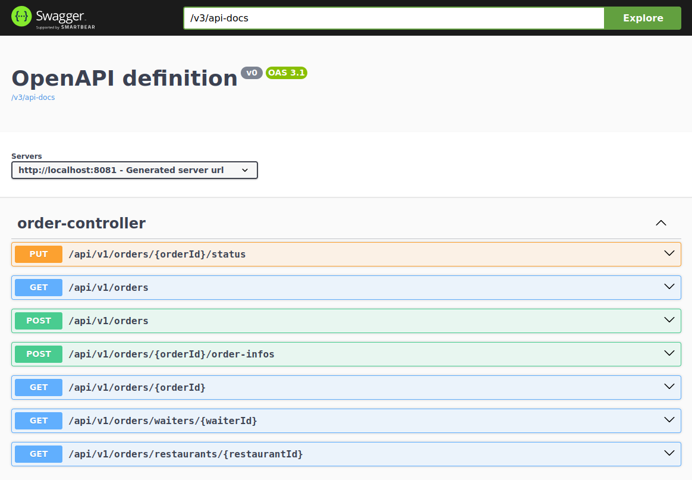

<h1>Api documentation</h1>

<h2>Overview</h2>

Project's API is implemented as REST API.End points are consumed by clients synchronously using HTTP requests. 
There is versioning in place 
using URI path versioning i.e. endpoints are prefixed with <b>/api/:versionNumber</b>

Todo: <b>Host Swagger UI and add it to documentation to make it interactive. 

